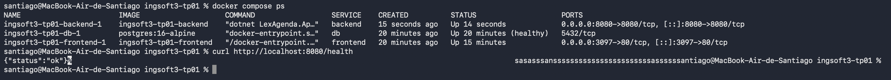
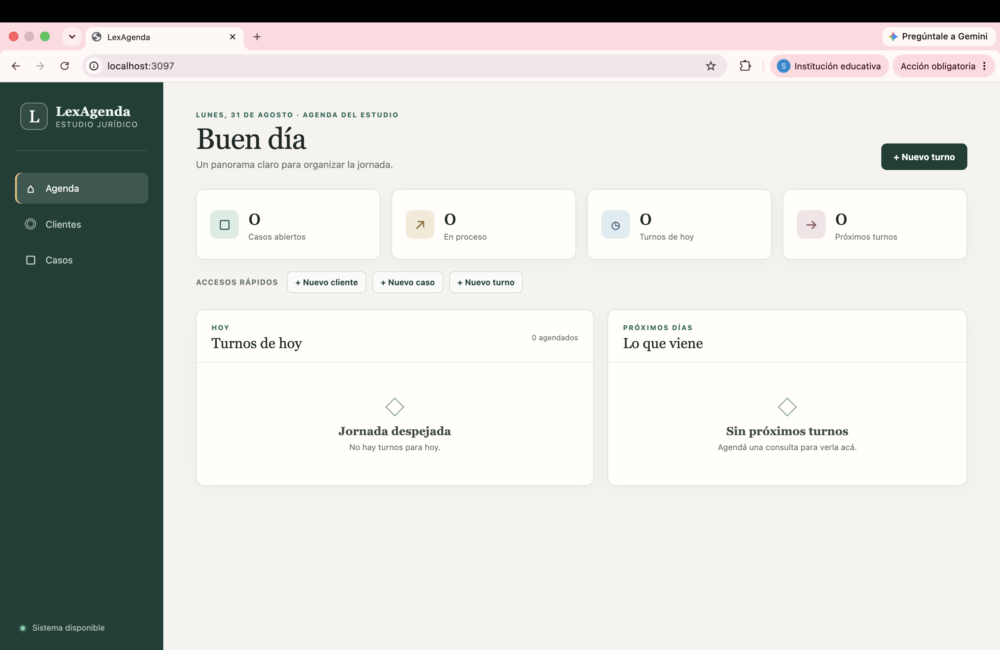
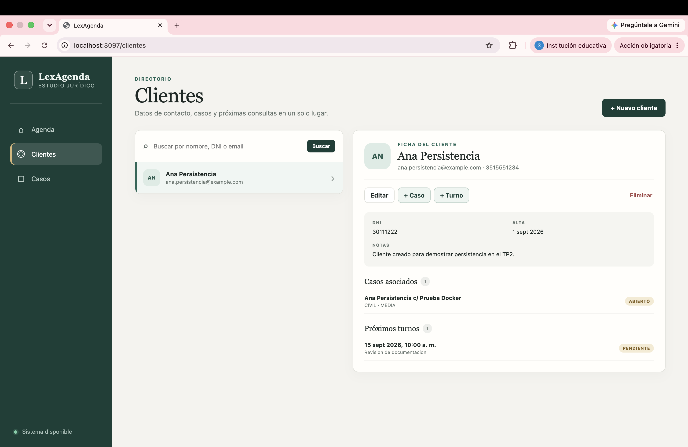
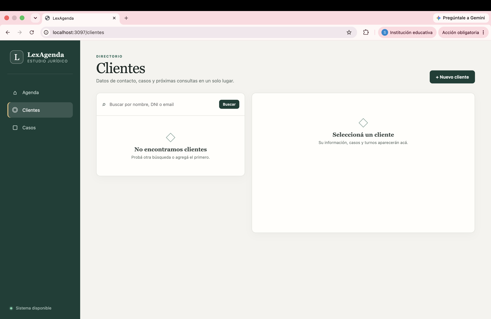
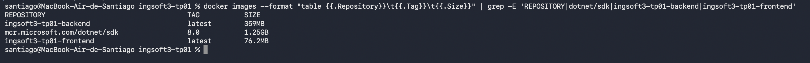
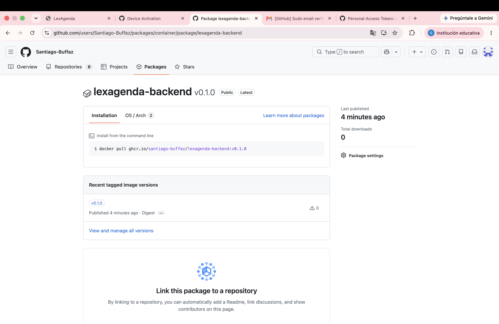
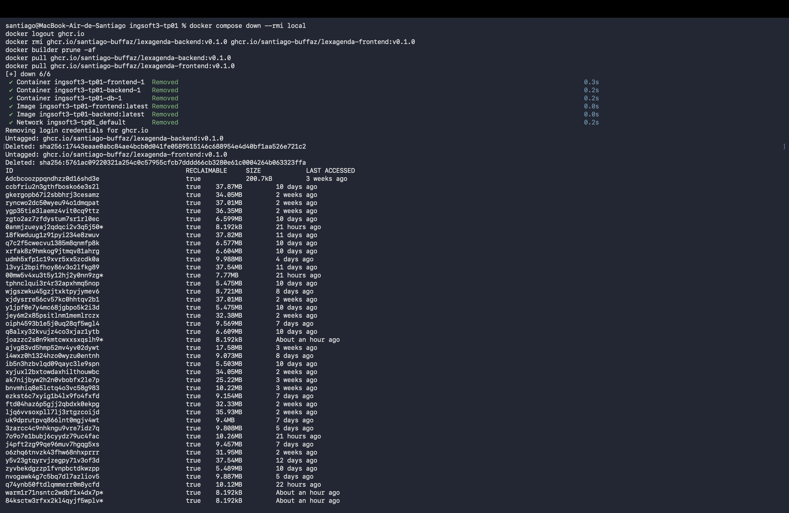
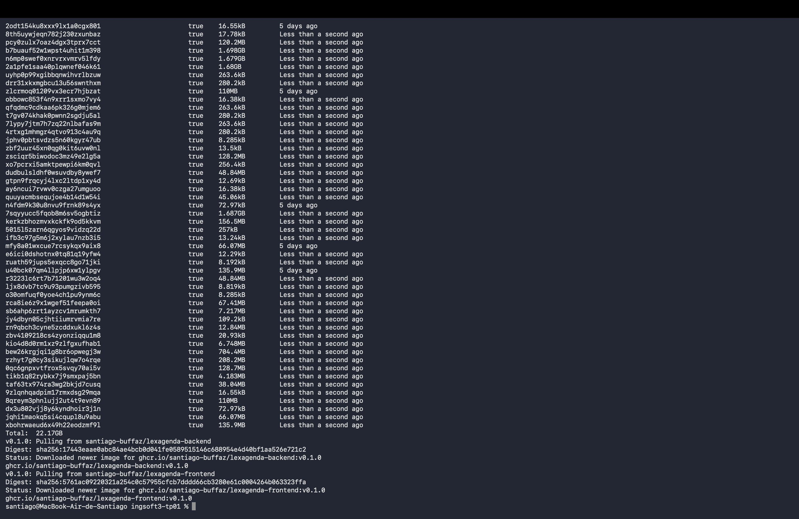
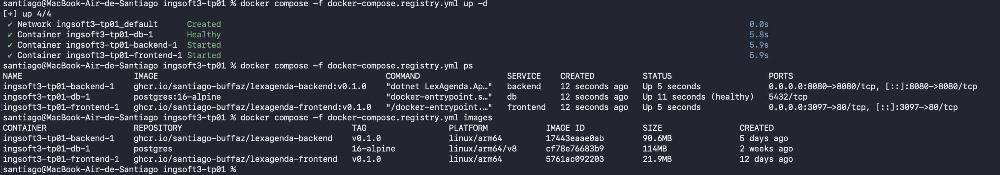
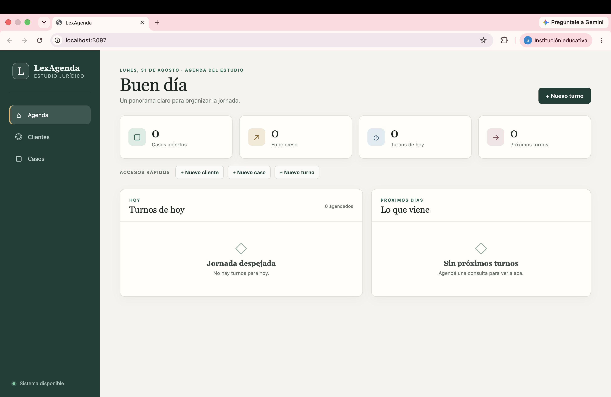

# Evidencias de los trabajos prácticos

Las capturas y salidas de esta sección deben corresponder a ejecuciones reales de este repositorio.

## TP2 — Contenedores

### 1. Build y sistema end-to-end

Comandos ejecutados desde la raíz:

```bash
cp .env.example .env
docker compose up -d --build
docker compose ps
```

Resultado verificado nuevamente el 31/08/2026 en Mac arm64:

- PostgreSQL quedó `healthy`.
- Backend y frontend quedaron en ejecución.
- `GET http://localhost:8080/health` respondió `{"status":"ok"}`.
- `GET /health` a través de nginx respondió el mismo JSON.
- La interfaz creó un cliente, un caso y un turno; los tres se consultaron luego por la API.
- El frontend usó nginx → `backend:8080`; el backend usó `db:5432`.

Salida de `docker compose ps`:

```text
NAME                       SERVICE    STATUS                   PORTS
ingsoft3-tp01-backend-1    backend    Up                       0.0.0.0:8080->8080/tcp
ingsoft3-tp01-db-1         db         Up (healthy)             5432/tcp
ingsoft3-tp01-frontend-1   frontend   Up                       0.0.0.0:3097->80/tcp
```



Aplicación recién levantada desde cero:



Flujo end-to-end después de crear un cliente, un caso y un turno:



### 2. Tests y reglas observadas

```text
Passed! - Failed: 0, Passed: 13, Skipped: 0, Total: 13
```

Además de la suite, se verificaron respuestas reales:

```text
POST /api/turnos (horario superpuesto)
HTTP 409
{"error":"superposicion","mensaje":"El turno se superpone con otro turno pendiente o confirmado."}

POST /api/clientes (email repetido)
HTTP 409
{"error":"email_duplicado","mensaje":"Ya existe un cliente con ese email."}
```

Desde la pantalla Casos se intentó cerrar un caso en proceso con un turno futuro activo. La API lo rechazó y la UI mostró:

```text
No se puede cerrar el caso porque tiene turnos futuros activos.
```

### 3. Persistencia

Se creó el cliente `Ana Persistencia`, el caso `Ana Persistencia c/ Prueba Docker` y un turno asociado. Después se ejecutó:

```bash
docker compose down
docker compose up -d
curl http://localhost:8080/api/clientes
```

La respuesta volvió a incluir al mismo cliente. Extracto de la salida:

```json
[{"nombreCompleto":"Ana Persistencia","dni":"30111222","email":"ana.persistencia@example.com"}]
```

Esto confirma que `db_data` sobrevivió a la recreación de los tres contenedores.


Después de registrar la evidencia, se eliminó el volumen usado en la validación para entregar el workspace limpio y evitar que una contraseña anterior quedara asociada a PostgreSQL.

La prueba destructiva se hizo después de guardar las capturas anteriores:

```bash
docker compose down -v
docker compose up -d
curl http://localhost:8080/api/clientes
```

Resultado real: `[]`. La lista quedó vacía porque `-v` eliminó también `db_data`.



### 4. Tamaños de imágenes

Salida observada en Mac arm64:

```text
mcr.microsoft.com/dotnet/sdk:8.0    1.25GB
ingsoft3-tp01-backend:latest        359MB
ingsoft3-tp01-frontend:latest       76.2MB
```

La imagen final del backend es aproximadamente 3,5 veces menor que el SDK. La final del frontend contiene nginx y los estáticos; Node no viaja a producción.



### 5. Auditoría del frontend

```text
found 0 vulnerabilities
```

El build de Vite finalizó correctamente y generó `dist/`.

### 6. Registry público

Se publicaron las dos imágenes de LexAgenda en GitHub Container Registry con versión semántica `v0.1.0`:

- `ghcr.io/santiago-buffaz/lexagenda-backend:v0.1.0`
- `ghcr.io/santiago-buffaz/lexagenda-frontend:v0.1.0`

Ambos packages se configuraron con visibilidad pública y tag `v0.1.0`.




Para comprobar que las imágenes eran realmente públicas, primero se cerró la sesión de GHCR y se eliminaron las referencias locales.



Después se descargaron nuevamente ambas imágenes sin credenciales. Los dos comandos finalizaron con `Downloaded newer image`.



Finalmente se levantó el sistema mediante `docker-compose.registry.yml`, que consume las imágenes públicas en lugar de construirlas desde el código local.



La aplicación quedó operativa en `localhost:3097` utilizando las imágenes descargadas.


